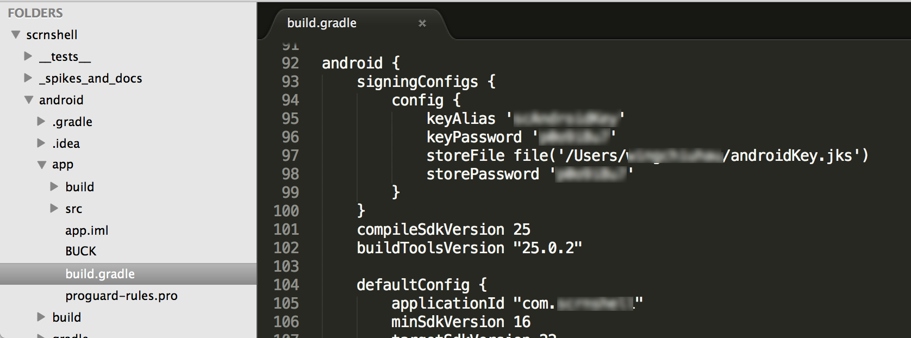

# Deploy Android APK

### Step 1

From the command line at the top level within your folder structure

    react-native bundle --platform android --entry-file index.android.js --bundle-output android/app/src/main/assets/index.android.bundle --dev false

If there is an error mentioning the path below you may need to create it first using 

    mkdir android/app/src/main/assets

Note I got another error saying `Assets destination folder is not set, skipping...` which I ignored

### Step 2 

Change this lower left panel so they all say release instead of debug.  Change it back when you want to run in local emulator.

### Step 3

Hit the green play button

### Step 4
I then got the following error (down the bottom of screengrab), requesting for signing docs

Which is solved by entering your details in android > app > build.gradle

### Step 5

Sync the gradle files with this button

### Step 6 

Hit the green play button again

### Step 7

When this window pops up ...

Select Build Types and change debug to release

### Step 8

Look for this input (it should be close to the UI from the last step but I dont remember where it is). 

Change it to 'config'

# Step 9

From the command line at the top level run `cd android && ./gradlew clean assembleRelease`

If you get <i>this error below</i>

    Could not list contents of '/Users/xxxxxxxxxx/myproject/
    node_modules/react-native/third-party/glog-0.3.4/test-
    driver'. Couldn't follow symbolic link.'

It is referenced [in this stack thread](https://stackoverflow.com/questions/44847537/rn-0-45-1-invalid-symlink-error-when-trying-to-deploy-to-simulator) and basically you just run unlink on that file from the top directory like this

    unlink node_modules/react-native/third-party/glog-0.3.4/test-driver

You want the `cd android && ./gradlew clean assembleRelease` to finnish at 100%. Then the APK is created.

# Step 10 - Get it onto your phone

One way is to use ADB (which I haven't learned yet) but for now you can email the APK to yourself then open the email on your phone and download and run it from there.

Email this file `android > app > build > outputs > apk > app-release.apk`

When opening it on your android phone don't send it to google drive and during the process you may be sent to phone settings > allow unknown sources

